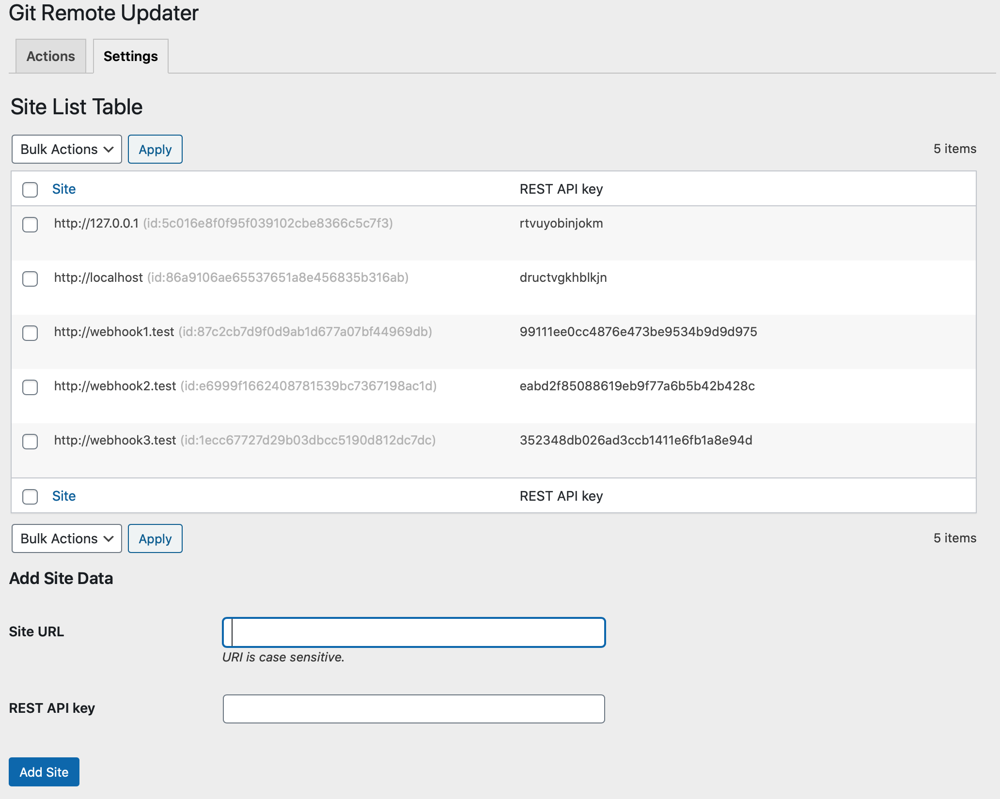
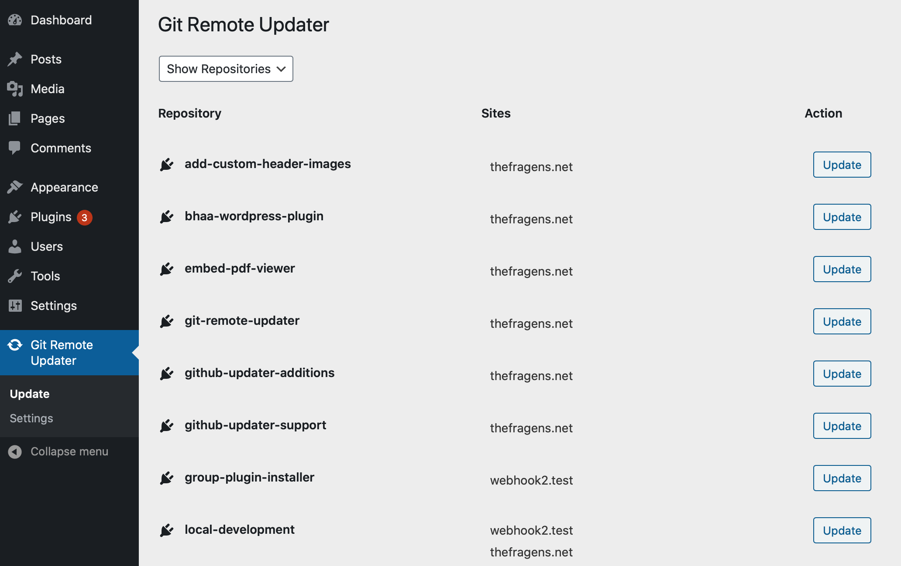
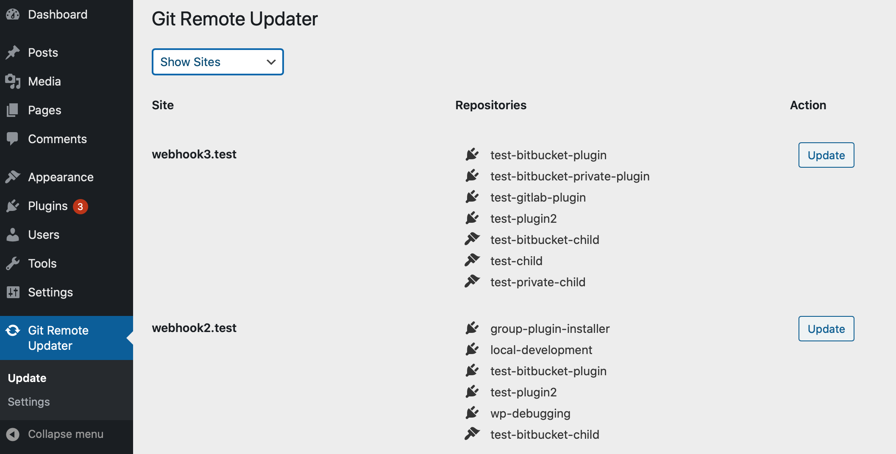
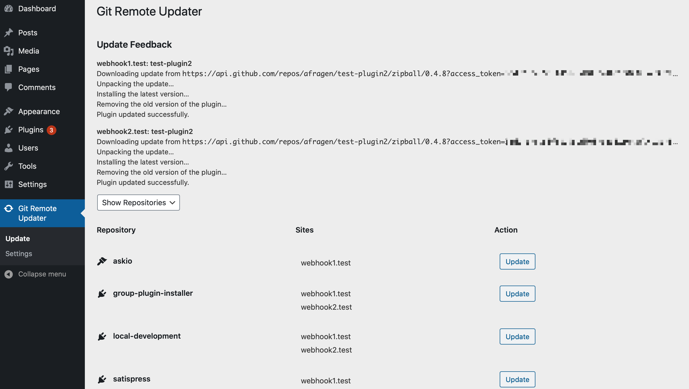

# Git Remote Updater

 * Plugin Name:       Git Remote Updater
 * Plugin URI:        https://github.com/afragen/git-remote-updater
 * Author:            Andy Fragen
 * Author URI:        https://github.com/afragen
 * License:           MIT
 * Requires PHP:      7.1
 * Requires at least: 5.2

## Description

Allows you to easily update GitHub Updater repositories in bulk via [REST API endpoint updating](https://github.com/afragen/github-updater/wiki/Remote-Management---RESTful-Endpoints).

The **Git Remote Updater** page allows updating via repository or site.

## Setup

Requires [GitHub Updater](https://github.com/afragen/github-updater) v.9.0.0 or higher running on the sites you use with Git Remote Updater.

You can obtain the needed data from your `GitHub Updater > Remote Management` tab and then copy it into the `Settings > Add Site` form. You will only need to update data if your REST API key changes.

Update feedback will show at the top of the page. If you have debug logging set on your site, it is also added to the `debug.log`.

I recommend running Git Remote Updater from a local development environment installation of WordPress. It makes the collection and transfer of JSON files simpler, though you can run it from any WordPress site.

## Usage

By using the `Site URL` and the `REST API key` you can add sites to the **Settings** tab.

Once you have site data added, the **Actions** tab will present options for you to update repositories.

You can update individual repositories across all the sites the exist on.

Or you can update all the repositories on an individual site at once.

The update process will continue until it succeeds. Feedback is presented at the top of the page when the process has completed. Feedback will also be added the the site's `debug.log`, if debug logging is set for the site.

If there is a timeout error in the update process, Git Remote Upater will continue to attempt updating until it succeeds.

Other errors will not attempt to retry the update an will display the appropriate error.

Any site that is unreachable will not display any repository data in the **Actions** tab.
